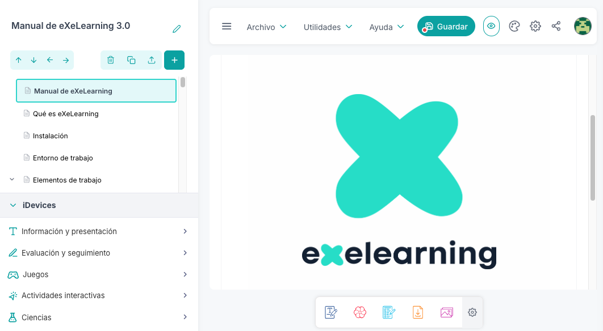

<!-- _class: title-academic -->

De la catedral al bazar

Modernización de eXeLearning mediante DevOps, integración continua y buenas prácticas de desarrollo

Ernesto Serrano

Granada, 2025

Escuela Internacional de Posgrado

<!--
NOTAS AL ORADOR:
- Presentarse
- Contexto: "Hoy presento mi plan de investigación para el doctorado en TIC"
- Hook inicial: "¿Qué pasa cuando un software educativo usado por miles de docentes está a punto de morir?"
- Duración total: 15-20 minutos aproximadamente
-->

---

<!-- _class: title -->

<!-- _backgroundColor: rgba(238, 238, 238, 0.91)  -->

# Programa de Doctorado en **TIC**

- Línea: **Soft Computing**
- Modalidad: **Compendio de artículos**
- Director: **Juan Julián Merelo Guervós**

<!--
NOTAS AL ORADOR:
- Mencionar la línea de Soft Computing: sistemas complejos, autoorganización
- Aclarar que será tesis por compendio (3 artículos previstos)
- Ventaja del compendio: validación externa continua de resultados
-->

---

<!-- _class: toc  -->

# Índice

0. [Título](#1)
1. [Introducción](#4)
2. [El problema](#6)
3. [La solución](#9)
4. [El plan](#14)
5. [El impacto](#18)
6. [Conclusiones](#20)

<!--
NOTAS AL ORADOR:
- Presentación estructurada en 5 bloques
- Cada bloque tiene un mensaje clave
- Introducción sitúa el contexto, problema establece el reto
- Mantener la atención en el "por qué" más que en el "qué"
-->

---

<!-- _class: chapter -->

# 1. Introducción

## El contexto del proyecto

<!--
NOTAS AL ORADOR:
- Empezar situando el contexto: ¿qué es eXeLearning?
- Importancia del proyecto para educación pública
- Base de usuarios consolidada
-->

---

# ¿Qué es **eXeLearning**?

#### Herramienta de autor de código abierto para crear **Recursos Educativos Abiertos** (REA)

- **Origen:** Nueva Zelanda (2007), luego España (INTEF, CEDEC)
- **Usuarios:** Miles de docentes en administraciones educativas
- **Función:** Crear contenido interactivo sin conocimientos técnicos
- **Formatos:** SCORM, HTML5, ePub, **elp**

<figcaption>Interfaz de eXeLearning: creación de REA.</figcaption>

<!--
NOTAS AL ORADOR:
- eXe es SOFTWARE CRÍTICO para educación pública
- REA = recursos abiertos, reutilizables, accesibles
- No solo un editor: exporta a estándares educativos
- Base de usuarios consolidada: Canarias, Extremadura, Andalucía, etc.
-->

---

<!-- _class: chapter -->

# 2. El problema

## De la catedral al bazar

<!--
NOTAS AL ORADOR:
- Pausa dramática
- "Ahora vamos al problema que motiva toda esta investigación"
- Conectar con la metáfora de Raymond: catedral vs bazar
-->

---

# La **doble crisis** del proyecto

### Crisis tecnológica

- Código en **Python 2** (fin de vida: 2020)
- Obsolescencia inevitable
- Deuda técnica masiva
- Riesgo de abandono

### Crisis de gobernanza

- Licitación 2021 (MEFP + CCAA) → **entrega fallida**
- Código incompleto, errores graves
- Arquitectura poco clara
- Desvinculación de socios clave

<!--
NOTAS AL ORADOR:
- Doble golpe: tecnología Y gobernanza
- Python 2 EOL = sin soporte, sin seguridad, sin futuro
- El intento institucional de modernización fracasó estrepitosamente
- Crisis de confianza: ¿quién continúa el proyecto?
-->
---

# De la **catedral** al **bazar**¹

### Modelo "Catedral"

- Desarrollo centralizado
- Equipo reducido y estable
- Financiación institucional
- Control jerárquico

### Modelo "Bazar"

- Desarrollo distribuido
- Comunidad de voluntarios
- Colaboración interadministrativa
- Autoorganización

<footnote>

¹ Raymond, E. S. (1999). *The cathedral and the bazaar.*

</footnote>

> **Reto central:** ¿Cómo estructurar el caos del bazar para rescatar el proyecto?

<!--
NOTAS AL ORADOR:
- Metáfora clásica de Raymond aplicada a un caso real
- Transición FORZOSA de catedral a bazar, no planificada
- El bazar tiene ventajas (resiliencia, diversidad) pero también riesgos (fragmentación, falta de dirección)
- Aquí entra la propuesta: DevOps como estructura para coordinar el bazar
-->

---

<!-- _class: chapter -->

# 3. La solución

## DevOps como estructura para el caos

<!--
NOTAS AL ORADOR:
- Cambio de tono: de problema a solución
- DevOps no es solo tecnología: es CULTURA + PROCESO + HERRAMIENTAS
- La tesis propone usar DevOps para ESTABILIZAR un sistema complejo
-->

---

# Hipótesis de trabajo

> ¿Se puede **reducir el tiempo de desarrollo, aumentar la frecuencia de entregas y disminuir la deuda técnica** de un proyecto OSS mediante DevOps, CI/CD, estándares y pruebas automatizadas?

**H1 - CI/CD**

↓ Tiempo de ciclo, ↑ estabilidad de releases.

**H2 - Calidad**

Estándares + revisión + análisis ↓ defectos, ↑ mantenibilidad.

**H3 - Deuda técnica**

Refactorización con pruebas contiene deuda y acelera evolución.

<!--
NOTAS AL ORADOR:
- Hipótesis MEDIBLE: no es filosofía, son MÉTRICAS concretas
- DORA, SonarQube, MTTR, Lead Time, etc.
- Cada hipótesis se validará con datos cuantitativos
- Comparación antes/después de la intervención DevOps
-->

---

# Marco teórico

### Paradoja de Teseo

¿Hasta dónde podemos cambiar eXe y seguir siendo eXe?

### Strangler Fig Pattern

Migración incremental: rodear el legado con componentes nuevos.

### Soft Computing

Repositorios como **sistemas complejos autoorganizados**.

### DevOps y CI/CD

Retroalimentación continua para estabilizar el "bazar".

<!--
NOTAS AL ORADOR:
- Teseo: cuestión filosófica pero práctica (¿cuándo deja de ser eXe?)
- Strangler Fig: patrón de migración segura (Martin Fowler)
- Soft Computing: visión de Merelo (director) sobre repositorios
- DevOps: la solución propuesta para coordinar el "bazar"
- Conexión: marcos teóricos → solución práctica

**Paradoja de Teseo** ¿Al sustituir casi todo el código original sigue siendo el mismo proyecto?

- **Reflexión** Identidad del software vs. identidad del código fuente

**Strangler Fig Pattern** Migración incremental sin parada total

- Estrategia: Rodear el legado con componentes nuevos y "estrangular" progresivamente

**Soft Computing:** Repositorios como **sistemas complejos autoorganizados**

-->

---

# Objetivos

> Desarrollar y validar una **metodología de modernización basada en DevOps** para mejorar proceso, calidad y sostenibilidad del proyecto eXeLearning.

**O1 - Diagnosticar**

- Línea base: deuda técnica, tiempos de ciclo, frecuencia de entrega

**O2 - Implementar**

- Pipeline CI/CD: pruebas, análisis estático, artefactos multiplataforma

**O3 - Evaluar**

- Comparación pre/post: métricas, calidad de código, feedback de usuarios

<!--
NOTAS AL ORADOR:
- Tres objetivos claros y secuenciales
- O1: saber dónde estamos (estado actual)
- O2: intervención técnica (pipeline CI/CD completo)
- O3: medir el impacto (validación empírica)
- Metodología científica: hipótesis → intervención → validación

**O1 - Diagnosticar**

Línea base cuantitativa:
- Deuda técnica
- Tiempos de ciclo
- Frecuencia de entrega

**O2 - Implementar**

Pipeline CI/CD:
- Pruebas automatizadas
- Análisis estático
- Artefactos multiplataforma

**O3 - Evaluar**

Comparación pre/post:
- Métricas DORA
- Calidad de código
- Encuestas y entrevistas

-->

---

# Metodología

### Enfoque iterativo DevOps

1. **Revisión bibliográfica:** Estado del arte - DevOps, OSS, métricas de calidad

2. **Diagnóstico inicial:** Análisis de código, commits, releases, deuda técnica

3. **Diseño e implantación:** Arquitectura, pipelines CI/CD, pruebas, análisis estático

4. **Evaluación:** Métricas, Calidad de código, Encuestas y entrevistas

5. **Producción científica:** Resultados → artículos → transferencia

<!--
NOTAS AL ORADOR:
- Metodología MIXTA: cuantitativa (métricas) + cualitativa (entrevistas)
- DORA = métricas de élite de ingeniería de software (Google, DevOps Research)
- Métricas de proceso (DORA): lead time, deployment frequency, MTTR, change failure rate
- Métricas de producto: deuda técnica, complejidad, cobertura de pruebas
- Validación triangulada: código + proceso + percepción de usuarios
-->

---

<!-- _class: chapter -->

# 4. El plan

## Hoja de ruta y producción científica

<!--
NOTAS AL ORADOR:
- Pausa
- "¿Cómo se ejecuta todo esto? Vamos al plan concreto"
- 3 años, 3 artículos, hitos claros
-->

---

# Planificación temporal (3 años)

| Actividad | Año 1 | Año 2 | Año 3 |
| :--- | :--- | :--- | :--- |
| **Marco teórico y diagnóstico** | Revisión sistemática y estado del arte | Revisión bibliográfica | Profundización teórica |
| **Diseño de solución CI/CD** | Arquitectura inicial | Automatización y monitorización | Optimización y simplificación |
| **Evaluación** | Evaluación inicial | Evaluación intermedia | **Validación final de hipótesis** |

<!--
NOTAS AL ORADOR:
- Tabla completa: ver cronograma en data.yaml
- Cada año tiene un HITO CIENTÍFICO (artículo)
- Año 1: fundamentos + primer artículo (historia)
- Año 2: implementación + segundo artículo (estándares)
- Año 3: validación + tercer artículo (DevOps y métricas) + defensa
- Compendio = validación externa continua
-->

---

# Producción científica prevista

### Artículo 1
**eXeLearning: pasado, presente y futuro**

- Historia del proyecto (NZ → España)
- Transición catedral → bazar

### Artículo 2
**Estándares para REA**

- Análisis comparativo: SCORM, xAPI, CMI5, H5P, ePub, **elp** y **elpx**
- Interoperabilidad
- Implicaciones para reutilización

### Artículo 3
**Arquitectura DevOps aplicada a OSS educativo**

- Diseño y validación de pipelines CI/CD
- Evaluación de impacto (métricas)

<!--
NOTAS AL ORADOR:
- 3 artículos = 3 contribuciones distintas
- Art. 1: CONTEXTO e HISTORIA (cualitativo + primeras métricas)
- Art. 2: ESTÁNDARES educativos (comparativa técnica)
- Art. 3: VALIDACIÓN de DevOps (cuantitativo + modelo transferible)
- Cada artículo puede ir a revista/conferencia diferente
-->

---

# Medios y financiación

### Recursos disponibles

**Infraestructura técnica**
- Repositorio GitHub de eXeLearning
- Servidores de CI/CD (INTEF, GitHub)
- Comunidad de desarrollo activa

### Financiación

**Recursos propios**

- Rol: Coordinador Técnico de Educación (Gobierno de Canarias)
- **Sin necesidad de financiación externa**

<!--
NOTAS AL ORADOR:
- Situación privilegiada: acceso total al proyecto + tiempo dedicado
- No se necesitan subvenciones (recurso propio garantizado)
- Alineación de intereses: tesis + proyecto real + beneficio público
- Sostenibilidad garantizada
-->

---

<!-- _class: chapter -->

# 5. El impacto

## Resultados esperados

<!--
NOTAS AL ORADOR:
- "¿Qué va a aportar esta tesis?"
- Dos niveles: práctico (eXe funciona) + teórico (modelo validado)
-->

---

# Resultados esperados

**Validación cuantitativa:**
- Impacto de DevOps en proyectos OSS tipo "bazar"
- Métricas de calidad de código en contexto educativo
- Relación entre CI/CD y reducción de la deuda técnica

<!--
NOTAS AL ORADOR:
- Impacto DUAL: rescatar eXe + crear conocimiento transferible
- REA as Code: idea innovadora (recursos educativos tratados como código fuente)
- Ventajas: versionado, revisión por pares, trazabilidad, integración con CI/CD
- Potencial de cambio en cómo se crean y mantienen los recursos educativos abiertos

- Métricas basadas en literatura DevOps (DORA, Accelerate)
- Validación empírica en caso real de eXeLearning
- Si se confirman: modelo replicable; si NO: también es conocimiento científico
- Impacto DUAL: técnico (proceso) + organizativo (comunidad)
-->

---

<!-- _class: chapter -->

# 6. Conclusiones

## Más allá de eXeLearning

<!--
NOTAS AL ORADOR:
- Slide final antes de preguntas
- Mensaje: esta tesis trasciende el caso particular de eXeLearning
- Hablar del impacto más amplio en el ecosistema OSS educativo
-->

---

# Conclusiones

Esta tesis responde a un **reto real** y busca generar **conocimiento transferible** que beneficie al ecosistema educativo.

### Para eXeLearning

- Rescate de un proyecto crítico usado por miles de docentes
- Metodología validada y sostenible
- Comunidad coordinada y resiliente

### Para la comunidad científica

- Validación empírica de DevOps en OSS educativo

<!--
NOTAS AL ORADOR:
- Triple impacto: eXe (práctico) + ciencia (teórico) + comunidad (transferible)
- No es solo "arreglar eXe": es crear un MODELO replicable
- REA as Code: paradigma innovador para gestionar recursos educativos
- Énfasis: conocimiento científico validado y transferible
- Sostenibilidad garantizada por integración con rol laboral
-->

---

<!-- _class: title -->

<!-- _backgroundColor: rgba(238, 238, 238, 0.91)  -->

# Muchas gracias

### ¿Preguntas o comentarios?

<!--
NOTAS AL ORADOR:
- Pausa, mirada al tribunal
- "Estoy abierto a preguntas, comentarios o sugerencias para mejorar el plan"
- Anticipar posibles preguntas:
  * ¿Cómo garantizas la validez de las métricas?
  * ¿Qué pasa si la comunidad no adopta DevOps?
  * ¿Cómo gestionas conflictos entre administraciones?
  * ¿REA as Code ya existe en algún sitio?
-->

---

<!-- _class: "references" -->

# Bibliografía

1. **Aguado-Moralejo, R. et al. (2021).** *eXeLearning, una herramienta de autor para la creación de Recursos Educativos Abiertos.*
2. **Prasad, P. W. C. (2017).** *Open source software for open educational resources.*
3. **González, S. S. (2019).** *eXeLearning: la herramienta de autor que fomenta la creación de recursos educativos abiertos.*
4. **Raymond, E. S. (1999).** *The cathedral and the bazaar.* O'Reilly.

5. **Ministerio de Educación y Formación Profesional (2021).** *Resolución de la Secretaría de Estado de Educación.*
6. **Li, J. et al. (2020).** *Microservice architecture: A case study of a legacy system.*
7. **Merelo, J. J. et al. (2017).** *Self-organized criticality in software repositories.*
8. **Capiluppi, A. et al. (2007).** *The cathedral and the bazaar: A study of the open source development model.*

<!--
NOTAS AL ORADOR:
- Referencias clave del data.yaml
- Raymond: marco conceptual principal (catedral/bazar)
- Merelo: director, experto en soft computing y repositorios
- Resto: contexto de eXeLearning y modernización de software
-->

---

<!-- _class: white-slide -->

<!--
NOTAS AL ORADOR:
- Slide final de cierre
- Silencio, logo UGR
- Esperar preguntas o comentarios finales
-->
